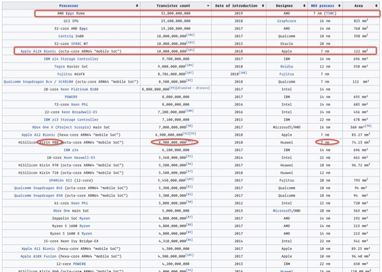

# study feeling

## [wikipedia.org/wiki/Transistor_count](https://en.wikipedia.org/wiki/Transistor_count)

晶体管数量


## [godoc.org/fmt](https://godoc.org/fmt)

golang pkg and third-part pkg

## [golang.org/pkg/fmt](https://golang.org/pkg/fmt/)

golang pkg

遇到问题, 不同人有不同解决方案
搜出来的资料的质量,预示越到后面,越相行渐远

```go
三等IT人问群主
二等IT人查baidu/google 看js忍者秘籍, 慕课网
一等IT人查wiki, godoc, golang.org <深入理解计算机组成原理> <算法4>
```

看此udemy 只为学习别人如何学习如何查询资料的.
